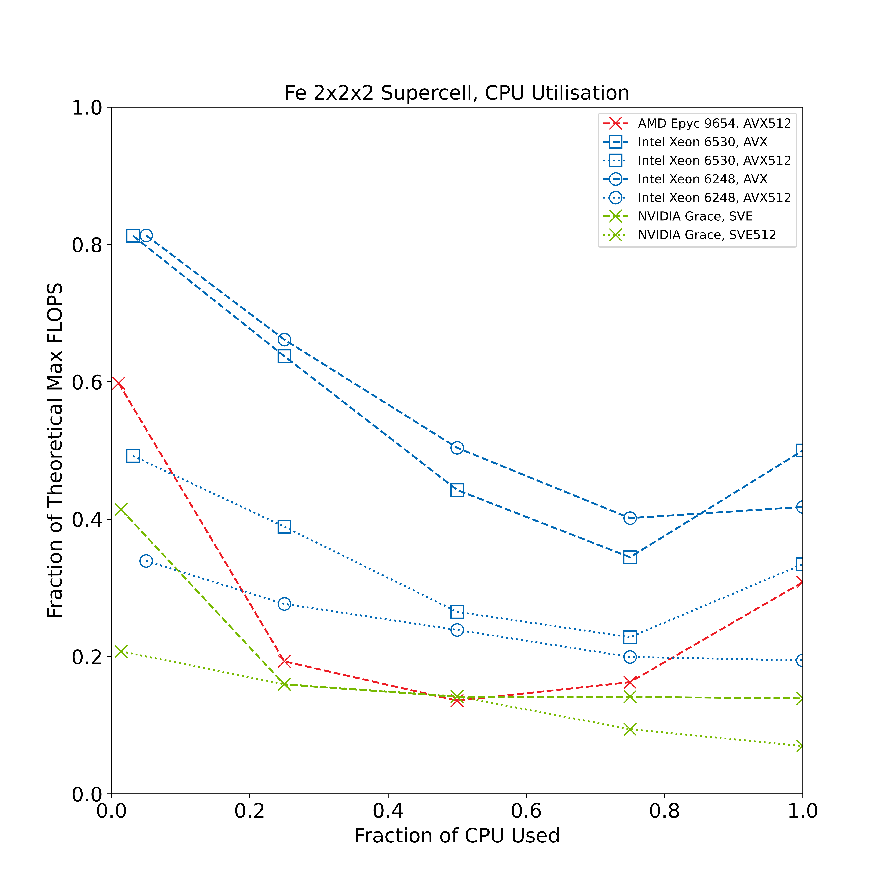
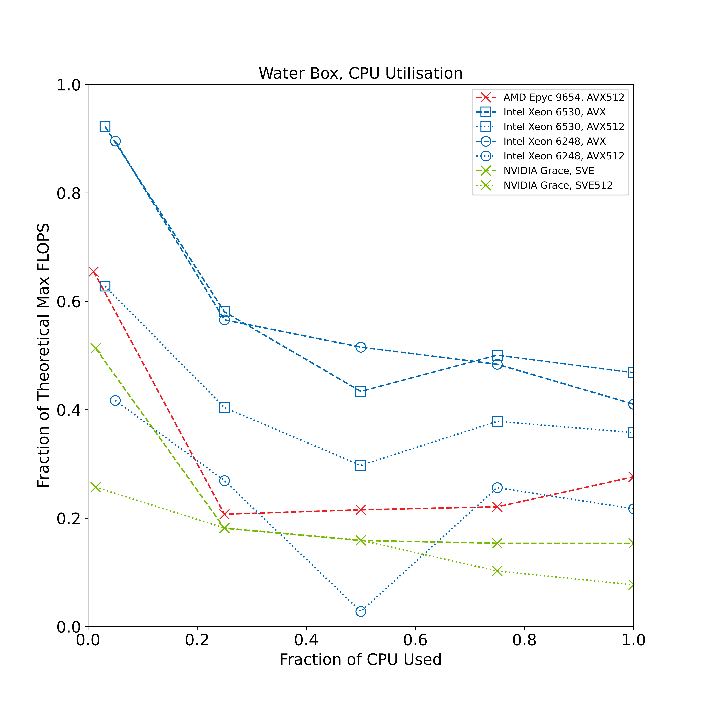
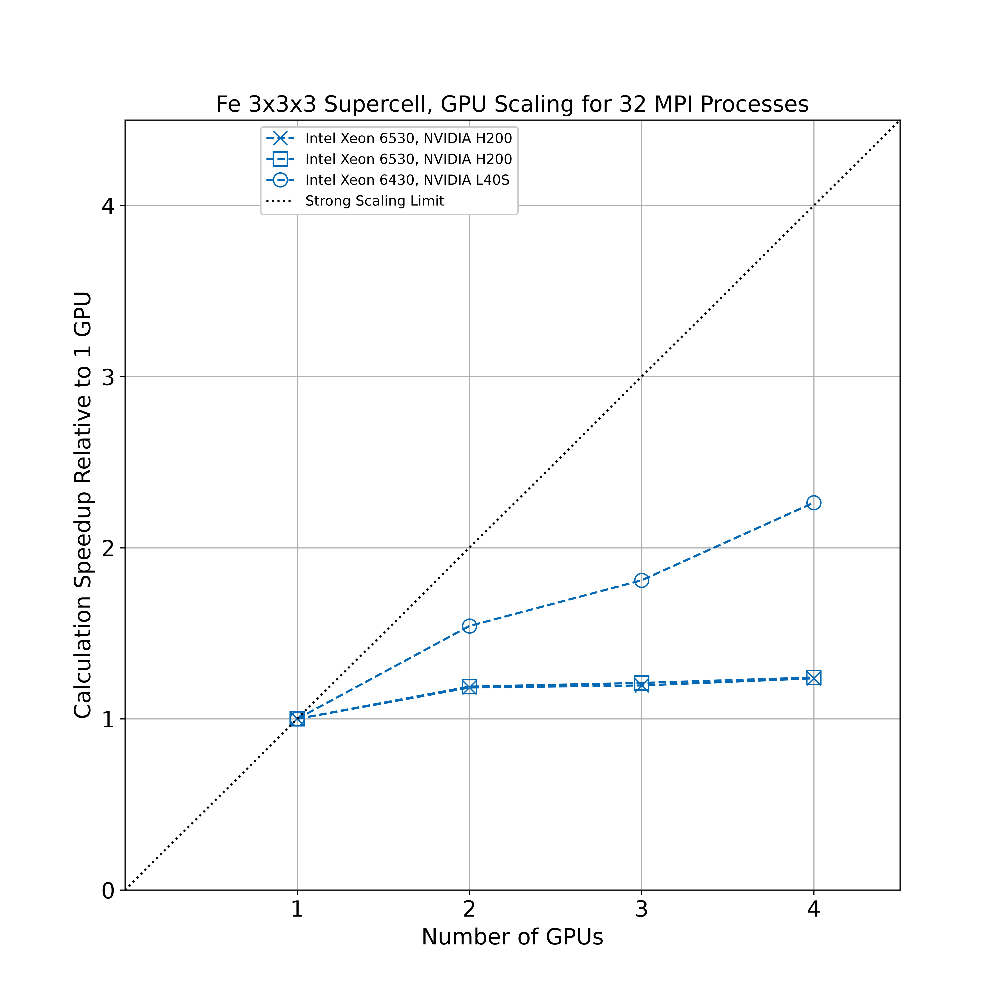
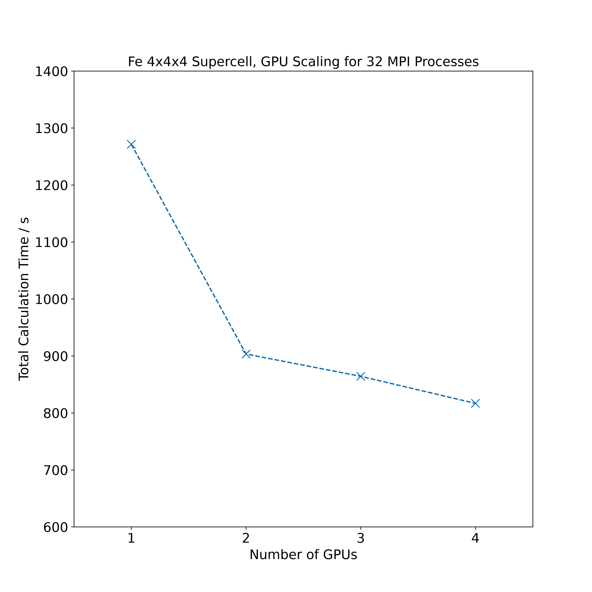
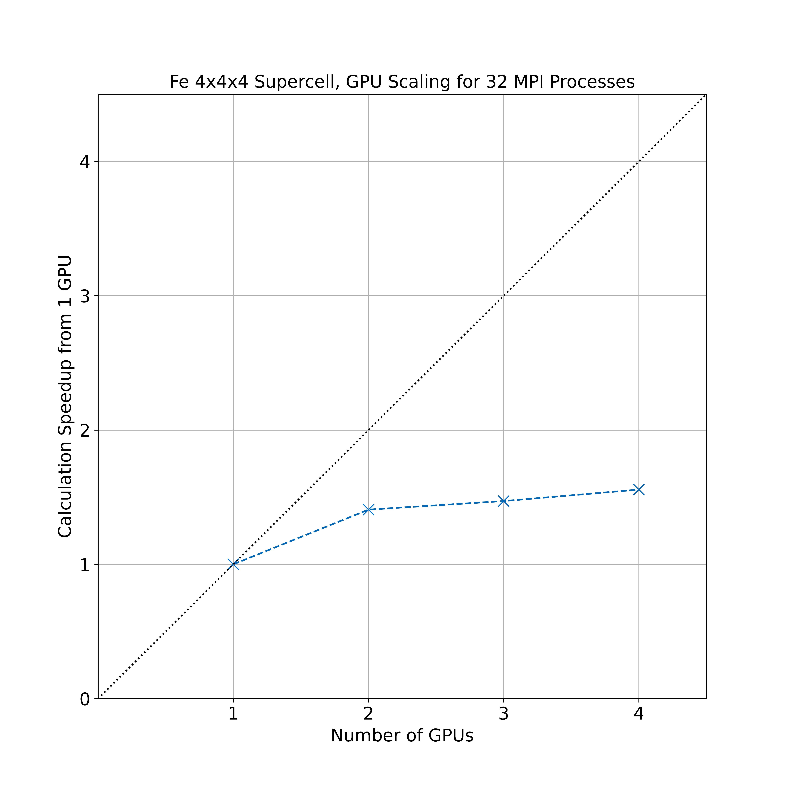

[---]: #
[License: Copyright © 2026 Durham University, SHAREing Project, MIT Licensed]: #
[Creator: Andrew Naden]: #
[Contributors: Andrew Naden; Ananya Gangopadhyay]: #
[Summary: Pre-assessment report template document]: #
[---]: #

# Pre-assessment of CASTEP for SHAREing Task 019

## Assessment objective

This is a pre-assessment study of the performance of the planewave Density Functional Theory (DFT) code CASTEP, performed by Oscar van Vuren at Cardiff University, in collaboration with Gabriel Bramley and Andrew Logsdail (Cardiff University), Phil Hasnip from the University of York and Martyn Guest of Advanced Research Computing at Cardiff (ARCCA). CASTEP allows for the accurate simulation of the electronic structure of condensed matter, to scales of hundreds to thousands of atoms. The CASTEP code has seen historical use for benchmarking flagship HPC facilities in the UK, including [HECToR](http://www.hector.ac.uk/cse/reports/castep_m.pdf), [ARCHER](https://github.com/hpc-uk/archer-benchmarks/tree/main/apps/CASTEP) and [ARCHER2](https://www.archer2.ac.uk/about/hardware.html), and sees contemporary use in condensed matter simulations across the globe.

The associated SHAREing work package for this pre assessment of CASTEP is [WP 019](https://shareing-dri.github.io/tasks/019_castep/). The objective of this assessment is to provide a preliminary set of performance data, benchmarks and compilation instructions to allow for a more detailed, rigorous benchmark of CASTEP in future by SHAREing.

CASTEP version 26 was benchmarked using CPU only and GPU accelerated workloads on three different HPC architectures.

## Disclaimers

1. This report is not a commentary on code quality, but an indicator of the quality of the current SHAREing testing methodology as of `31/07/2026`.

## Table of contents

- [1: Benchmark setup](#1-benchmark-setup)
- [2: Description of working environment](#2-description-of-working-environment)
- [3: Compiler setup and optimisations](#3-compiler-setup-and-optimisations)
- [4: Computational complexity and scaling](#4-computational-complexity-and-scaling)
- [5: Memory, storage and I/O](#5-memory-storage-and-io)
- [6: Additional comments from submitter](#6-additional-comments-from-submitter)

## 1: Benchmark setup

Two regimes were explored in the benchmarking procedure; a close packed metal system with a dense **k**-point mesh (Fe cell, 16 atoms) and a molecular system (periodic water box, 20 $\times$ 20 $\times$ 20 &angst; ) sampled at the $\Gamma$-point only. This allows for the comparison of parallelisation in CASTEP over **k** points and over **G** vectors, and the acceleration possible in these two extremes of condensed matter simulation.

<figure>
   
   <figcaption> Figure 1: 16 iron atoms in a periodic box (black lines): the Fe 2 &times; 2 &times; 2 system. </figcaption>
</figure>

<figure>
   
   <figcaption> Figure 2: 200 water molecules inside a periodic box spanning 20 &angst; &times; 20 &angst; &times; 20 &angst; (black lines). Red and white atoms represent oxygen and hydrogen, respectively. </figcaption>
</figure>

### Fetch and build program

CASTEP is licensed by STFC, providing a free of cost license for academic use. This is different from the commercial license for CASTEP, available from BIOVIA. To gain a license for the academic use of CASTEP, a request may be made at <https://licences.stfc.ac.uk/product/castep>. The source code of CASTEP version 26 may then be downloaded from STFC and installed using the `make` scripts included in the `scripts` directory of this repository.

The `scripts` directory contains shell scripts to install CASTEP for CPU only and GPU accelerated applications. These scripts require user input to define a correct combination of compilers and libraries. Notably, to build GPU accelerated code, the NVIDIA Fortran and C compilers from the NVIDIA HPC SDK must be used to build CASTEP. Combination of maths libraries, FFT libraries and compilers are allowed, though the use of the Intel MKL FFT library requires the use of the Intel MKL maths libraries. When compiling using the included scripts, `make` will request user input for the location of the FFT and maths libraries. If the libraries are in the `PATH` environment variable, the user can leave this prompt empty by returning an empty line. Optionally, the location of the libraries can be specified by including the make directives `MATHLIBDIR` and `FFTLIBDIR` in the installation shell script from this repository, and uncommenting the relevant lines in the CASTEP top level `Makefile`.

### Fetch and run benchmark

The benchmarks for this pre-assessment of CASTEP can be obtained from:

```bash
git clone https://github.com/OscarvanVuren/castep_bench.git
```

This repository contains the benchmark input files in the `benchmarks` directory, as well as the compilation scripts for building both CPU only and GPU accelerated binaries of CASTEP in the `scripts` directory. Additionally, reference data for the benchmarks performed as part of this pre-assessment are available in the `data` directory.

To run the benchmark, the compiled binary for CASTEP is called using `mpirun` or `srun` depending on the test platform. A seedfile name must be provided; "Fe" or "H2O_box" in the case of the iron or water box testcases, respectively. The overall syntax for a CASTEP run is, therefore:

```bash
export SEEDNAME=<seed_name>
export EXECUTABLE=<path/to/castep.mpi>
mpirun -np <n_tasks> $EXECUTABLE $SEEDNAME 
```

when using MPI natively, or

```bash
srun -n <n_slurm_tasks> $EXECUTABLE $SEEDNAME
```

in a Slurm queue system. In both cases, these commands will perform a CASTEP run using the number of tasks (`n_tasks` or `n_slurm_tasks`) specified.
> [!NOTE]
> CASTEP will not always run with the number of tasks specified, but will instead use the most tasks possible when parallelising over **k**-points. The Fe benchmark has a total of 32 **k**-points, thus optimally uses multiples of 32 tasks. When using very few MPI tasks, this automatic optimisation is ignored to ensure performance at low core counts.

The `SEEDNAME` used in running the benchmarks determines the output filenames. Most file I/O has been disabled; however, CASTEP will generate two files during execution: a`SEEDNAME.castep` output file, containing calculation data and timings, and a `.usp` file containing the on-the-fly-generated (OTFG) pseudopotential for each species in the `SEEDNAME.cell` file.

### Reference architecture

## 2: Description of working environment

### Hardware information

Three different HPC clusters were used in this pre-assessment, chosen due to a combination of availability and hardware variety. This information is taken from the websites linked for each header and corroborated by running `cat /proc/cpuinfo` or `lscpu`, particularly `lscpu -C` for detailed cache information, on the compute nodes. Only relevant compute hardware has been mentioned in these descriptions; untested hardware has been omitted.

1. The [Falcon](https://wiki.arcca.cf.ac.uk/index.php/The_Falcon_Supercomputer) cluster at Cardiff University.
   - `compute`: AMD EPYC Genoa 9654 CPU. 192 cores per node. 30 nodes.
   - `gpu_h200`: Intel Xeon (Emerald Rapids) 6530 CPU, NVIDIA H200 GPU. 64 CPU cores per node, 4 H200 GPUs per node. 1 node.
   - `gpu_h100`: Intel Xeon (Emerald Rapids) 6530 CPU, NVIDIA H100 GPU. 64 CPU cores per node, 4 H100 GPUs per node. 1 node.
   - `gpu_l40s`: Intel Xeon (Sapphire Rapids) 6430 CPU, NVIDIA L40S GPU. 64 CPU cores per node, 8 L40S GPUs per node. 2 nodes.
   - `gpu_v100`: Intel Xeon (Cascade Lake) 6248 CPU, NVIDIA V100 GPU. 40 CPU cores per node, 2 V100 GPUs per node. 13 nodes.

2. The [Isambard3 Multi-Architecture Comparison System (MACS)](https://docs.isambard.ac.uk), hosted by Bristol University.
   - `ampere`: AMD EPYC Milan 7543P CPU, NVIDIA A100 GPU. 32 CPU cores per node, 4 A100 GPUs per node. 2 nodes.

3. The [Bede](https://bede-documentation.readthedocs.io/en/latest/index.html) cluster from the N8 Group, hosted at Durham University.

   - `gh`: NVIDIA Grace-Hopper GH200 Superchip. NVIDIA Grace CPU, 72 cores per node. 1 H100 GPU per node. 8 nodes.

**Falcon CPU `compute`**

| Specification             | Per node                                                                     |
| ------------------------- | ---------------------------------------------------------------------------- |
| Processors                | 2  $\times$  [AMD EPYC Genoa 9654](https://www.amd.com/en/products/processors/server/EPYC/4th-generation-9004-and-8004-series/amd-EPYC-9654.html)        |
| Clock speed per CPU       | 2.4 GHz                                                                     |
| Sockets                   | 2                                                                          |
| Cores (per socket)        | 192 (96)                                                                        |
| CPU Cache                 | <ul><li>L1d 6 MiB </li><li> L1i 6 MiB </li><li> L2 192 MiB </li><li> L3 768 MiB </li></ul>      |
| RAM                       | 768 GB DDR5                                                               |

**Falcon GPU H200 `gpu_h200`**

| Specification             | Per node                                                                     |
| ------------------------- | ---------------------------------------------------------------------------- |
| Processors                | 2  $\times$  [Intel Xeon Gold (Emerald Rapids) 6530](https://www.intel.com/content/www/us/en/products/sku/237249/intel-xeon-gold-6530-processor-160m-cache-2-10-ghz/specifications.html)        |
| GPU                       | 4  $\times$  [NVIDIA H200](https://www.nvidia.com/en-gb/data-center/h200/) |
| GPU Memory                | 140 GB                                                                         |
| GPU Connect               | SXM5                                                                        |
| Clock speed per CPU       | 4.0 GHz                                                                     |
| Sockets                   | 2                                                                          |
| Cores (per socket)        | 64 (32)                                                                        |
| CPU Cache                 | <ul><li>L1d 6 MiB </li><li> L1i 6 MiB </li><li> L2 192 MiB </li><li> L3 768 MiB </li></ul>     |
| RAM                       | 1000 GB DDR5                                                               |

**Falcon GPU H100 `gpu_h100`**

| Specification             | Per node                                                                     |
| ------------------------- | ---------------------------------------------------------------------------- |
| Processors                | 2  $\times$  [Intel Xeon Gold (Emerald Rapids) 6530](https://www.intel.com/content/www/us/en/products/sku/237249/intel-xeon-gold-6530-processor-160m-cache-2-10-ghz/specifications.html)        |
| GPU                       | 4  $\times$  [NVIDIA H100](https://www.nvidia.com/en-gb/data-center/h100/) |
| GPU Memory                | 80 GB                                                                         |
| GPU Connect               | SXM5                                                                        |
| Clock speed per CPU       | 4.0 GHz                                                                     |
| Sockets                   | 2                                                                          |
| Cores (per socket)        | 64 (32)                                                                       |
| CPU Cache                 | <ul><li>L1d 6 MiB </li><li> L1i 6 MiB </li><li> L2 192 MiB </li><li> L3 768 MiB </li></ul>                              |
| RAM                       | 1000 GB DDR5                                                               |

**Falcon GPU L40S `gpu_l40s`**

| Specification             | Per node                                                                     |
| ------------------------- | ---------------------------------------------------------------------------- |
| Processors                | 2  $\times$  [Intel Xeon Gold (Sapphire Rapids) 6430](https://www.intel.com/content/www/us/en/products/sku/231737/intel-xeon-gold-6430-processor-60m-cache-2-10-ghz/specifications.html)        |
| GPU                       | 8  $\times$  [NVIDIA L40S](https://www.nvidia.com/en-gb/data-center/l40s/) |
| GPU Memory                | 48 GB                                                                         |
| GPU Connect               | PCIe                                                                        |
| Clock speed per CPU       | 4.0 GHz                                                                     |
| Sockets                   | 2                                                                          |
| Cores (per socket)        | 64 (32)                                                                        |
| CPU Cache                 | <ul><li>L1d 6 MiB </li><li> L1i 6 MiB </li><li> L2 192 MiB </li><li> L3 768 MiB </li></ul>                              |
| RAM                       | 1000 GB DDR5                                                               |

**Falcon GPU V100 `gpu_v100`**

| Specification             | Per node                                                                     |
| ------------------------- | ---------------------------------------------------------------------------- |
| Processors                | 2  $\times$  [Intel Xeon Gold (Cascade Lake) 6248](https://www.intel.com/content/www/us/en/products/sku/192446/intel-xeon-gold-6248-processor-27-5m-cache-2-50-ghz/specifications.html)        |
| GPU                       | 2  $\times$  [NVIDIA V100](https://www.nvidia.com/en-gb/data-center/tesla-v100/) |
| GPU Memory                | 16 GB                                                                         |
| GPU Connect               | PCIe                                                                        |
| Clock speed per CPU       | 2.5 GHz                                                                     |
| Sockets                   | 2                                                                          |
| Cores (per socket)        | 40 (20)                                                                       |
| CPU Cache                 | <ul><li>L1d 1.3 MiB </li><li> L1i 1.3 MiB </li><li> L2 40 MiB </li><li> L3 55 MiB </li></ul>     |
| RAM                       | 360 GB DDR5                                                               |

**Isambard3 MACS `ampere`**

| Specification             | Per node                                                                     |
| ------------------------- | ---------------------------------------------------------------------------- |
| Processors                | 1  $\times$  [AMD EPYC Milan 7543P](https://www.amd.com/en/products/processors/server/EPYC/7003-series/amd-EPYC-7543p.html)        |
| GPU                       | 4  $\times$  [NVIDIA A100](https://www.nvidia.com/en-gb/data-center/a100/) |
| GPU Memory                | 40 GB                                                                         |
| GPU Connect               | SXM4                                                                        |
| Clock speed per CPU       | 4.0 GHz                                                                     |
| Sockets                   | 1                                                                          |
| Cores (per socket)        | 32 (32)                                                                       |
| CPU Cache                 | <ul><li>L1d 1 MiB </li><li> L1i 1 MiB </li><li> L2 16 MiB </li><li> L3 256 MiB </li></ul>     |
| RAM                       | 256 GB DDR5                                                               |

**Bede Grace Hopper `gh`**

| Specification             | Per node                                                                     |
| ------------------------- | ---------------------------------------------------------------------------- |
| Processors                | 1  $\times$  [NVIDIA GRACE](https://www.nvidia.com/en-gb/data-center/grace-cpu-superchip/)        |
| GPU                       | 1  $\times$  [NVIDIA H100](https://www.nvidia.com/en-gb/data-center/h100/) |
| GPU Memory                | 96 GB                                                                         |
| GPU Connect               | NVLink-C2C                                                                        |
| Clock speed per CPU       | 3.483 GHz                                                                     |
| Sockets                   | 1                                                                          |
| Cores (per socket)        | 72 (72)                                                                   |
| CPU Cache                 | <ul><li>L1d 9 MiB </li><li> L1i 9 MiB </li><li> L2 144 MiB </li><li> L3 228 MiB </li></ul>                            |
| RAM                       | 480 GB DDR5                                                               |

### Libraries and modules

CASTEP depends on three core maths libraries: LAPACK, BLAS and an FFT library.

#### LAPACK and BLAS

CASTEP supports multiple implementations of BLAS and LAPACK: [flexiblas](https://www.mpi-magdeburg.mpg.de/projects/flexiblas), [openblas](https://www.openmathlib.org/OpenBLAS/docs/), [mkl](https://www.intel.com/content/www/us/en/developer/tools/oneapi/onemkl.html), [blis](https://github.com/flame/blis), [libflame](https://github.com/flame/libflame), [aocl](https://www.amd.com/en/developer/aocl.html), [atlas](https://math-atlas.sourceforge.net/), [essl](https://www.ibm.com/docs/en/aix/7.1.0?topic=techniques-calling-blas-essl-libraries), [scilib](https://cpe.ext.hpe.com/docs/latest/csml/cray_libsci.html), default, generic. Links for more information have been provided where possible. The Flame library (libflame) contains LAPACK only, and therefore must be paired with a BLAS library (BLIS is recommended). "default" and "generic" options are synonyms and specify no particular BLAS and LAPACK library, and instead search for `libblas` and `liblapack` in the `PATH`.

#### FFT Library

The simplest FFT library to use with CASTEP is the [Fastest Fourier Transform in the West (FFTW)](https://www.fftw.org/) library, which implements a performant and portable FFT algorithm. Another supported FFT library is included in the Intel oneAPI Maths Kernel Library (MKL), but this requires use of the MKL versions of BLAS and LAPACK.

## 3: Compiler setup and optimisations

The requirement of compiling on multiple systems and architectures has driven the choice of compilers and optimisations for the building of CASTEP. The build process is supported by GNU Make: example scripts to build CPU only and GPU accelerated binaries are available in the `scripts` directory of the benchmark repository. For all GPU accelerated binaries, the NVIDIA Fortran and C compilers, `nvfortran` and `nvc` were used. CASTEP 26, as tested in this work, only supports GPU acceleration via the openACC standard, which only allows for acceleration with NVIDIA GPUs and compilation with the NVIDIA compilers.

Optimisation was standardised at the CASTEP level, which allows for the automated building of standard `debug`, `intermediate`, `fast` or `coverage` binaries, controlled by the `BUILD` directive given to `make`. This pre-assessment has exclusively used `BUILD=fast` to ensure that compiler optimisation of CASTEP is performed as expected for production level simulations. For `gfortran`, the `fast` compiler flags are: `-O3 -funroll-loops -fno-signed-zeros -g -fbacktrace`. For `nvfortran`, compiler optimisation flags are: `-fastsse -O3`. For `ifort`, optimisation flags are: `-O3 -debug minimal -traceback`

## 4: Computational complexity and scaling

For the benchmarks presented thus far, the limits of strong scaling are reached. This is mainly due to the benchmarks themselves being optimised for intranode testing and GPU acceleration profiling within a single node environment. Expanding the tests to explore strong scaling across multiple nodes is possible by expanding the size of the system under consideration, by creating larger supercells to model more atoms in the benchmarks.

In the cases where the regular benchmarks were not large enough, the supercell size for the Fe benchmark was increased from 2 $\times$ 2 $\times$ 2 to 4 $\times$ 4 $\times$ 4; an increase in number of atoms by factor of 8. This will increase the computational complexity of the simulation by a significant amount, as the cost of DFT scales with the cube of the number of atoms. Alternatively, the Fe benchmark can be scaled by increasing or decreasing the number of **k**-points sampled, via modifying the `KPOINTS_MP_GRID` keyword in `Fe.cell` from `4 4 4`. For the larger 4 $\times$ 4 $\times$ 4 supercell, the number of **k** points was reduced to `2 2 2` to keep the sampling density of **k** space similar to that performed in the smaller benchmark. Making the grid non-uniform, for example `KPOINTS_MP_GRID 5 6 7`, is not recommended for physical reasons. Increasing the number of **k**-points will increase the computational complexity of the benchmark by a linear factor of the product of the integers given to `KPOINTS_MP_GRID`.

The water box benchmark can be scaled by increasing the planewave cutoff energy beyond 400 eV in `H2O_box.param`  using the `cut_off_energy` keyword. Suggested cutoff energies to increase the complexity of the water box task are 600 eV or 800 eV.

## 5: Memory, storage and I/O

CASTEP provides an estimate of the memory requirement for each run, based on approximations of the memory requirements of the code and static data, model inputs, and estimates of the memory needs of the electronic localisation procedure, force computation and stress computation. These estimates, for both benchmarks, are collated below for different CPU architectures. The overall memory requirements are mostly driven by the size of the CASTEP binary, which varies greatly between compilation and architecture, ranging from 25739.0 MB in the case of the AMD EPYC Genoa 9654 build, to 8681.0 MB for the Intel Xeon 6530 build. The estimated memory needs of the model and computations are identical between compilations and are tabulated below, constructed from serial runs of CASTEP for each benchmark.

**Fe 2 $\times$ 2 $\times$ 2**

|Memory Use Case                             | Estimated Memory Need Per Process / MB |
|--------------------------------------------|----------------------------------:     |
|Model and support data                      | 1542.3                                 |
|Electronic energy minimisation requirements | 2348.2                                 |
|Force calculation requirements              | 34.8                                   |
|Stress calculation requirements             | 34.8                                   |

**Water Box**

|Memory Use Case                             | Estimated Memory Need Per Process / MB |
|--------------------------------------------|----------------------------------:     |
|Model and support data                      | 7605.0                                 |
|Electronic energy minimisation requirements | 4664.4                                 |
|Force calculation requirements              | 262.8                                  |
|Stress calculation requirements             | 319.1                                  |

Additionally, each benchmark writes output files to the disk, totalling approximately 1.5 MB for the water box benchmark and 2 MB for the Fe benchmark. There is also the potential for CASTEP to output a detailed timing profile using the code block:

```
%block devel_code
TRACE PROF: * :END PROF
%endblock devel_code
```

which writes a file `SEEDNAME.MPI_PROC.profile` for each MPI process used in the benchmark run. These files are only written after the simulation is complete and each one is around 350 KB.

## 6: Additional comments from submitter

### Benchmarking Data for CASTEP

Included in this section are the outcomes from preliminary benchmarking performed using the methods described above. Testing was performed on the HPC facilities [enumerated previously](#2-description-of-working-environment), with each CPU and CPU/GPU combination profiled individually.

#### Hardware Performance

To assess the utilisation of CPU resources when performing simulations using CASTEP, the peak performance of each CPU model was measured and compared to the calculated performance of each CPU model for CASTEP simulation runs. This data was collected using [Likwid](https://github.com/RRZE-HPC/likwid), specifically the `likwid-bench` tool and the `likwid-perfctr` tool. Each CPU was considered individually; if there were multiple CPUs present in a single node, only the first socket was used for profiling, specifially pinning tasks to threads.

`likwid-bench` allows for the peak performance of each CPU, measured in millions of floating point operations per second (MFLOPS / s), to be profiled. This profiling used datasets that would fit entirely within the L1 cache of each CPU, ensuring that performance of the CPU was not limited by data transfers into and out of cache. A short script to perform these benchmarks is available in the `scripts` directory of this repository.

`likwid-perfctr` was used as a wrapper around `mpirun` to profile the parallel performance of a CASTEP run for each benchmark system. The challenge when using this tool is understanding the intsructions sets available to the CPU and how well utilised these instruction sets are. Therefore, where the data is available, we have presented CPU utilisation for vectorised simulations that most closely match the compiler optimisations employed by CASTEP for each CPU architecture when using the `BUILD=fast` directive.

<figure>
   
   <figcaption> Figure 3: Raw calculation timing data for the Fe 2 &times; 2 &times; 2 benchmark. </figcaption>
</figure>

<figure>
   
   <figcaption> Figure 4: Raw calculation timing data for the water box benchmark. </figcaption>
</figure>

#### CASTEP CPU-Only Performance

**Fe 2 $\times$ 2 $\times$ 2**

Raw timing data for the CPU only performance of various architectures, alongside strong scaling up to 32 MPI processes, are presented here.

<figure>
   
   <figcaption> Figure 5: Raw calculation timing data for the Fe 2 &times; 2 &times; 2 benchmark. </figcaption>
</figure>

<figure>
   
   <figcaption> Figure 6: Strong scaling of the Fe 2 &times; 2 &times; 2 benchmark, up to 32 MPI processes. </figcaption>
</figure>

**Waterbox**

<figure>
   
   <figcaption> Figure 7: Raw calculation timing data for the water box benchmark. </figcaption>
</figure>

<figure>
   
   <figcaption> Figure 8: Strong scaling of the water box benchmark, up to 32 MPI processes. </figcaption>
</figure>

#### CASTEP GPU Accelerated Performance

**Fe 2 $\times$ 2 $\times$ 2**

<figure>
   
   <figcaption> Figure 9: Raw calculation timing data for the Fe 2 &times; 2 &times; 2 benchmark, when using GPU acceleration. </figcaption>
</figure>

<figure>
   
   <figcaption> Figure 10: Speedup from CPU by using a GPU for the Fe 2 &times; 2 &times; 2 benchmark. </figcaption>
</figure>

<figure>
   
   <figcaption> Figure 11: Computational cost saving from using a GPU for the Fe 2 &times; 2 &times; 2 benchmark. Higher is better. </figcaption>
</figure>

**Waterbox**

<figure>
   
   <figcaption> Figure 12: Raw calculation timing data for the water box benchmark, when using GPU acceleration. </figcaption>
</figure>

<figure>
   
   <figcaption> Figure 13: Speedup from CPU by using a GPU for the water box benchmark. </figcaption>
</figure>

<figure>
   
   <figcaption> Figure 14: Computational cost saving from using a GPU for the water box benchmark. Higher is better. </figcaption>
</figure>

**Multi-GPU Scaling Performance**

Exploring the scaling of CASTEP calculations on multiple GPUs was challenging. As we have considered only the iron system in this scaling test, as this model is simpler to increase in cost. The benchmark we have been using thus far, the Fe 2 &times; 2 &times; 2 benchmark, was found to be too small to reasonably see performance gains from using multiple GPUs, so the benchmark was increased in size to 3 &times; 3 &times; 3, or 54 atoms. In an attempt to keep this simulation tractable, the number of **k** points considerd was reduced to 8. This size of system begins to push the boundaries of what can be considered an effective benchmark, with respect to total wall time, and yet was still found to be too small to properly assess GPU scaling using CASTEP. Yet, we present results using this testcase as they display the relative performance of GPU models for CASTEP applications.

<figure>
   
   <figcaption> Figure 15: Calculation timing data for an expanded Fe 3 &times; 3 &times; 3 benchmark, when using GPU acceleration with multiple GPUs. </figcaption>
</figure>

Given that the 54 atom cell was too small to see scaling with number of GPUs, and that the overall wall time for these simulations was moving well beyond the suggested maximum of 10 minutes, the performance of a larger Fe 4 &times; 4 &times; 4 cell (128 atoms) with 32 **k** points was assessed using multiple GPUs and 32 MPI tasks. Results are presented for the H200 GPU only, as all other GPUs lacked the memory to run this simulation on a single GPU.
<figure>
   
   <figcaption> Figure 16: Calculation timing data for an expanded Fe 4 &times; 4 &times; 4 benchmark, when using GPU acceleration with multiple GPUs. </figcaption>
</figure>

<figure>
   
   <figcaption> Figure 17: Calculation speedup for using more GPUs on an expanded Fe 4 &times; 4 &times; 4 benchmark. The dashed black line shows the strong scaling limit </figcaption>
</figure>

#### Compiler Testing

As well as profiling the performance of hardware on HPC facilities using these benchmarks, the effect of compiler and library combination has been explored. This was done using the Fe 2 $\times$ 2 $\times$ 2 benchmark, pinned at 16 MPI processes. Performance as a function of compiler and library stack was measured, comparing `gfortran+openMPI+openBLAs+FFTW3` to an Intel stack of `ifort+Intel MPI+MKL+MKL_FFT`. Additionally, an NVIDIA toolchain was explored where possible, using the NVIDIA Performance Libraries (NVPL) and openMPI as shipped with the NVIDIA HPC Toolkit (`nvfortran+openMPI+NVPL+FFTW3`). These were chosen to match, as closely as possible, the `foss`, `intel` and `NVHPC` toolachins from [EasyBuild](https://docs.easybuild.io/common-toolchains/).

<figure>
   
   <figcaption> Figure 18: Calculation time for an Fe 2 &times; 2 &times; 2 benchmark on 16 MPI processes, when compiling CASTEP using different compiler and library stacks. Lower is better.
</figure>

#### Data Availability

The data used to generate these plots is available as a `.csv` from the `data` directory. All raw data, including input and output files from all CASTEP simulations, is available [here](https://doi.10.17035/cardiff.33155102).
